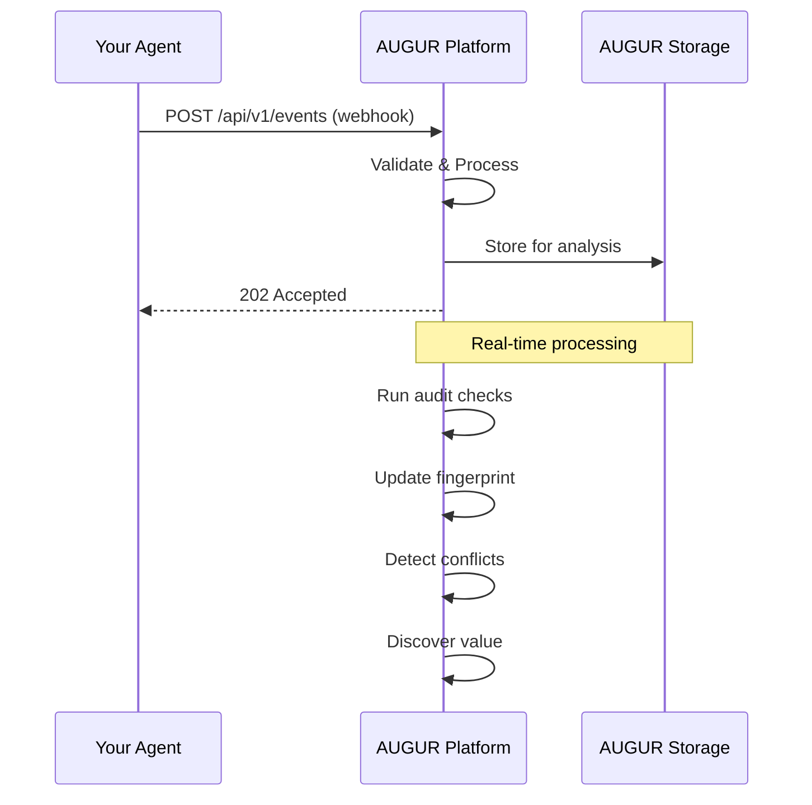
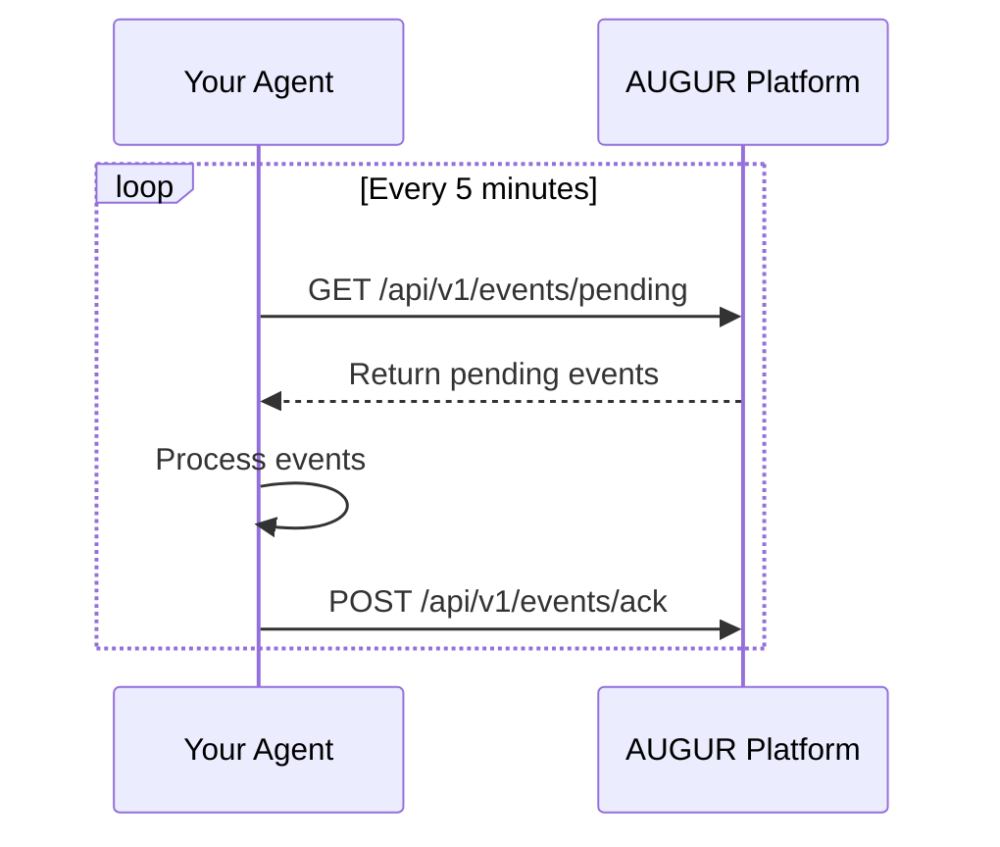
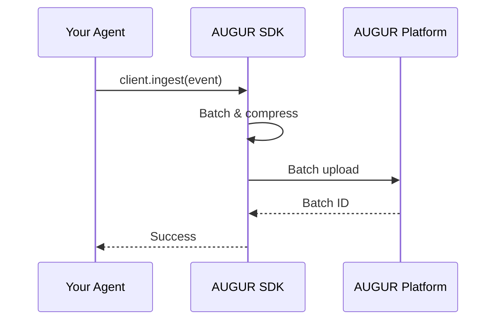

# AUGUR Integration Guide

## Overview

AUGUR integrates with any AI agent that has an API, webhook support, or logging capability. This guide covers integration with major platforms, custom agents, and provides code examples for common scenarios.

## Supported Platforms

| Platform | Integration Type | Status | Documentation |
|----------|-----------------|--------|---------------|
| **Accenture AATA** | Native | ✅ Certified | [Link](#accenture-aata) |
| **McKinsey Lilli** | Native | ✅ Certified | [Link](#mckinsey-lilli) |
| **Deloitte Zora** | Native | ✅ Certified | [Link](#deloitte-zora) |
| **OpenAI** | API | ✅ Supported | [Link](#openai) |
| **Anthropic Claude** | API | ✅ Supported | [Link](#anthropic-claude) |
| **Google Gemini** | API | ✅ Supported | [Link](#google-gemini) |
| **Microsoft AutoGen** | SDK | ✅ Supported | [Link](#microsoft-autogen) |
| **LangChain** | SDK | ✅ Supported | [Link](#langchain) |
| **LlamaIndex** | SDK | ✅ Supported | [Link](#llamaindex) |
| **Custom Agents** | API/Webhook | ✅ Supported | [Link](#custom-agents) |
| **Legacy Systems** | REST API | ✅ Supported | [Link](#legacy-systems) |

## Integration Methods

### Method 1: Webhook Integration (Simplest)



### Method 2: API Pull Integration



### Method 3: SDK Integration



## Platform-Specific Integrations

### Accenture AATA

#### Overview

Accenture AATA (Advanced Technology Agent) is a platform for building and deploying AI agents in enterprise environments. AUGUR provides native integration with AATA.

#### Configuration

```python
# aata_integration.py
from aata_sdk import AATAClient
from augur import AUGURClient

# Initialize clients
aata = AATAClient(api_key="your_aata_key")
augur = AUGURClient(api_key="your_augur_key")

# Register AATA agents with AUGUR
for agent in aata.agents.list():
    augur.agents.register(
        id=agent.id,
        name=agent.name,
        type="aata",
        environment="production",
        metadata={
            "aata_workspace": agent.workspace,
            "aata_version": agent.version
        }
    )

# Set up webhook forwarding
def aata_webhook_handler(event):
    """Forward AATA events to AUGUR."""
    augur.events.ingest(
        agent_id=event.agent_id,
        event_type=event.type,
        timestamp=event.timestamp,
        data=event.data
    )

# Configure AATA to send events to AUGUR
aata.webhooks.register(
    url="https://api.augur.ai/v1/events",
    events=["agent.action", "agent.error", "agent.feedback"]
)
```

#### Environment Variables

```bash
# .env
AATA_API_KEY=your_aata_api_key
AATA_WORKSPACE=your_workspace
AUGUR_API_KEY=your_augur_api_key
AUGUR_API_URL=https://api.augur.ai/v1
```

#### Docker Compose

```yaml
# docker-compose.yml
version: '3.8'
services:
  aata-bridge:
    image: augur/aata-bridge:latest
    environment:
      AATA_API_KEY: ${AATA_API_KEY}
      AATA_WORKSPACE: ${AATA_WORKSPACE}
      AUGUR_API_KEY: ${AUGUR_API_KEY}
      AUGUR_API_URL: ${AUGUR_API_URL}
    ports:
      - "8080:8080"
    restart: unless-stopped
```

### McKinsey Lilli

#### Overview

McKinsey Lilli is a knowledge management and AI assistant platform. AUGUR integrates with Lilli to monitor and optimize agent performance.

#### Configuration

```python
# lilli_integration.py
from lilli_sdk import LilliClient
from augur import AUGURClient

# Initialize clients
lilli = LilliClient(
    api_key="your_lilli_key",
    instance="your-instance.lilli.ai"
)
augur = AUGURClient(api_key="your_augur_key")

# Register Lilli agents
knowledge_agents = lilli.agents.list(type="knowledge")
for agent in knowledge_agents:
    augur.agents.register(
        id=f"lilli_{agent.id}",
        name=agent.name,
        type="lilli",
        environment=agent.environment,
        metadata={
            "lilli_domain": agent.domain,
            "knowledge_base": agent.kb_id
        }
    )

# Set up Lilli event streaming
@lilli.on_event
def handle_lilli_event(event):
    """Handle Lilli events in real-time."""
    augur.events.ingest(
        agent_id=f"lilli_{event.agent_id}",
        event_type=event.type,
        timestamp=event.timestamp,
        data={
            "query": event.query,
            "response_length": len(event.response),
            "latency_ms": event.latency_ms,
            "confidence": event.confidence,
            "sources": event.sources_used
        }
    )
```

#### Lilli-Specific Features

AUGUR provides specialized analysis for Lilli agents:

| Feature | Description | Benefit |
|---------|-------------|---------|
| **Knowledge Gap Detection** | Identifies topics where Lilli lacks information | Improves knowledge base |
| **Citation Accuracy** | Tracks source usage and accuracy | Ensures reliable answers |
| **Expertise Mapping** | Maps agent expertise across domains | Optimizes routing |
| **Query Pattern Analysis** | Analyzes user query patterns | Improves UX |

### Deloitte Zora

#### Overview

Deloitte Zora is a suite of AI agents for business functions. AUGUR integrates with Zora to provide unified governance.

#### Configuration

```python
# zora_integration.py
from zora_sdk import ZoraClient
from augur import AUGURClient

# Initialize clients
zora = ZoraClient(
    api_key="your_zora_key",
    environment="production"
)
augur = AUGURClient(api_key="your_augur_key")

# Register Zora agents by domain
domains = ["finance", "marketing", "operations", "hr"]
for domain in domains:
    agents = zora.agents.list(domain=domain)
    for agent in agents:
        augur.agents.register(
            id=f"zora_{domain}_{agent.id}",
            name=agent.name,
            type="zora",
            environment="production",
            metadata={
                "zora_domain": domain,
                "zora_capabilities": agent.capabilities
            }
        )

# Configure Zora webhook
zora.webhooks.create(
    name="augur-integration",
    url="https://api.augur.ai/v1/events",
    events=["agent.completion", "agent.error", "agent.feedback"],
    secret="your_webhook_secret"
)
```

#### Zora-Specific Dashboards

AUGUR provides specialized dashboards for Zora agents:

```python
# Get Zora domain performance
zora_performance = augur.analytics.domain_performance(
    domain="finance",
    timeframe="last_30_days"
)

print(f"Finance Agents: {zora_performance.agent_count}")
print(f"Total Queries: {zora_performance.total_queries}")
print(f"ROI: ${zora_performance.roi:,.2f}")
print(f"Top Performer: {zora_performance.top_agent}")
```

### OpenAI

#### Overview

AUGUR integrates with OpenAI's API to monitor GPT-3.5, GPT-4, and other models.

#### Configuration

```python
# openai_integration.py
import openai
from augur import AUGURClient
import time

# Initialize clients
openai.api_key = "your_openai_key"
augur = AUGURClient(api_key="your_augur_key")

# Register OpenAI model
model_id = augur.agents.register(
    name="gpt4-production",
    type="openai-gpt4",
    environment="production",
    metadata={
        "model": "gpt-4-turbo-preview",
        "temperature": 0.7,
        "max_tokens": 4096
    }
).id

# Wrap OpenAI calls with AUGUR monitoring
def monitored_openai_call(messages, **kwargs):
    """Make OpenAI call with AUGUR monitoring."""
    
    start_time = time.time()
    
    try:
        # Make OpenAI call
        response = openai.ChatCompletion.create(
            model=kwargs.get("model", "gpt-4-turbo-preview"),
            messages=messages,
            temperature=kwargs.get("temperature", 0.7),
            max_tokens=kwargs.get("max_tokens", 4096)
        )
        
        latency_ms = (time.time() - start_time) * 1000
        
        # Send event to AUGUR
        augur.events.ingest(
            agent_id=model_id,
            event_type="completion",
            timestamp=time.time(),
            data={
                "messages": messages,
                "response": response.choices[0].message.content,
                "latency_ms": latency_ms,
                "tokens_used": response.usage.total_tokens,
                "model": kwargs.get("model"),
                "temperature": kwargs.get("temperature")
            }
        )
        
        return response
        
    except Exception as e:
        # Log error
        augur.events.ingest(
            agent_id=model_id,
            event_type="error",
            timestamp=time.time(),
            data={
                "error": str(e),
                "messages": messages
            }
        )
        raise

# Use the monitored function
response = monitored_openai_call(
    messages=[{"role": "user", "content": "Hello!"}],
    model="gpt-4-turbo-preview"
)
```

#### Batch Processing

```python
# Batch monitoring for efficiency
from augur import EventBatcher

batcher = EventBatcher(
    client=augur,
    batch_size=100,
    flush_interval=60  # seconds
)

@batcher.collect
def monitored_call(messages):
    """OpenAI call with batched monitoring."""
    start = time.time()
    response = openai.ChatCompletion.create(
        model="gpt-4-turbo-preview",
        messages=messages
    )
    
    return {
        "latency_ms": (time.time() - start) * 1000,
        "tokens_used": response.usage.total_tokens,
        "response": response.choices[0].message.content
    }
```

### Anthropic Claude

#### Overview

AUGUR integrates with Anthropic's Claude API for comprehensive monitoring and optimization.

#### Configuration

```python
# claude_integration.py
import anthropic
from augur import AUGURClient
import time

# Initialize clients
claude = anthropic.Anthropic(api_key="your_claude_key")
augur = AUGURClient(api_key="your_augur_key")

# Register Claude agent
claude_agent = augur.agents.register(
    name="claude-opus-production",
    type="claude-3-opus",
    environment="production",
    metadata={
        "model": "claude-3-opus-20240229",
        "max_tokens": 4096,
        "temperature": 0.7
    }
)

# Create monitored wrapper
class MonitoredClaude:
    def __init__(self, client, agent_id):
        self.client = client
        self.agent_id = agent_id
        self.augur = augur
    
    def complete(self, prompt, **kwargs):
        """Make Claude call with monitoring."""
        start = time.time()
        
        try:
            response = self.client.messages.create(
                model=kwargs.get("model", "claude-3-opus-20240229"),
                max_tokens=kwargs.get("max_tokens", 4096),
                temperature=kwargs.get("temperature", 0.7),
                messages=[{"role": "user", "content": prompt}]
            )
            
            latency = (time.time() - start) * 1000
            
            # Send to AUGUR
            self.augur.events.ingest(
                agent_id=self.agent_id,
                event_type="completion",
                timestamp=time.time(),
                data={
                    "prompt": prompt[:500],  # Truncate for privacy
                    "response_length": len(response.content[0].text),
                    "latency_ms": latency,
                    "tokens_used": response.usage.input_tokens + response.usage.output_tokens,
                    "model": kwargs.get("model")
                }
            )
            
            return response
            
        except Exception as e:
            self.augur.events.ingest(
                agent_id=self.agent_id,
                event_type="error",
                timestamp=time.time(),
                data={
                    "error": str(e),
                    "prompt": prompt[:500]
                }
            )
            raise

# Use monitored client
monitored_claude = MonitoredClaude(claude, claude_agent.id)
response = monitored_claude.complete("Explain quantum computing")
```

### Google Gemini

#### Overview

AUGUR integrates with Google's Gemini API for monitoring and optimization.

#### Configuration

```python
# gemini_integration.py
import google.generativeai as genai
from augur import AUGURClient
import time

# Initialize clients
genai.configure(api_key="your_gemini_key")
augur = AUGURClient(api_key="your_augur_key")

# Register Gemini model
gemini_agent = augur.agents.register(
    name="gemini-pro-production",
    type="gemini-pro",
    environment="production",
    metadata={
        "model": "gemini-1.5-pro",
        "temperature": 0.7,
        "max_tokens": 8192
    }
)

# Create monitored model
model = genai.GenerativeModel('gemini-1.5-pro')

def monitored_generate(prompt, **kwargs):
    """Generate with monitoring."""
    start = time.time()
    
    try:
        response = model.generate_content(prompt)
        latency = (time.time() - start) * 1000
        
        # Count tokens (approximate)
        tokens_used = len(prompt.split()) + len(response.text.split())
        
        augur.events.ingest(
            agent_id=gemini_agent.id,
            event_type="completion",
            timestamp=time.time(),
            data={
                "prompt": prompt[:500],
                "response_length": len(response.text),
                "latency_ms": latency,
                "tokens_used": tokens_used * 1.3,  # Approximate
                "model": "gemini-1.5-pro"
            }
        )
        
        return response
        
    except Exception as e:
        augur.events.ingest(
            agent_id=gemini_agent.id,
            event_type="error",
            timestamp=time.time(),
            data={
                "error": str(e),
                "prompt": prompt[:500]
            }
        )
        raise
```

### Microsoft AutoGen

#### Overview

AutoGen is a framework for building multi-agent systems. AUGUR integrates deeply with AutoGen to monitor and orchestrate agent teams.

#### Configuration

```python
# autogen_integration.py
import autogen
from autogen import AssistantAgent, UserProxyAgent, GroupChat, GroupChatManager
from augur import AUGURClient
import time

# Initialize AUGUR
augur = AUGURClient(api_key="your_augur_key")

# Create AutoGen agents with AUGUR monitoring
class MonitoredAssistantAgent(AssistantAgent):
    """AssistantAgent with AUGUR monitoring."""
    
    def __init__(self, name, **kwargs):
        super().__init__(name, **kwargs)
        
        # Register with AUGUR
        self.augur_agent = augur.agents.register(
            name=name,
            type="autogen-assistant",
            environment="production",
            metadata={
                "llm_config": kwargs.get("llm_config", {}),
                "system_message": kwargs.get("system_message", "")[:200]
            }
        )
    
    def generate_reply(self, messages=None, sender=None, **kwargs):
        """Generate reply with monitoring."""
        start = time.time()
        
        try:
            reply = super().generate_reply(messages, sender, **kwargs)
            latency = (time.time() - start) * 1000
            
            # Send to AUGUR
            augur.events.ingest(
                agent_id=self.augur_agent.id,
                event_type="autogen_reply",
                timestamp=time.time(),
                data={
                    "message_count": len(messages) if messages else 0,
                    "sender": str(sender),
                    "reply_length": len(str(reply)) if reply else 0,
                    "latency_ms": latency,
                    "conversation_id": getattr(sender, "conversation_id", None)
                }
            )
            
            return reply
            
        except Exception as e:
            augur.events.ingest(
                agent_id=self.augur_agent.id,
                event_type="error",
                timestamp=time.time(),
                data={
                    "error": str(e),
                    "message_count": len(messages) if messages else 0
                }
            )
            raise

# Create monitored group chat
class MonitoredGroupChat(GroupChat):
    """GroupChat with AUGUR monitoring."""
    
    def __init__(self, agents, messages, max_round=10):
        super().__init__(agents, messages, max_round)
        
        # Register group with AUGUR
        self.group_id = augur.value.register_group(
            name=f"group_{id(self)}",
            agent_ids=[a.augur_agent.id for a in agents if hasattr(a, 'augur_agent')]
        )
    
    def run_chat(self, **kwargs):
        """Run chat with monitoring."""
        start = time.time()
        
        result = super().run_chat(**kwargs)
        duration = time.time() - start
        
        # Send group metrics to AUGUR
        augur.events.ingest(
            agent_id=self.group_id,
            event_type="group_chat_complete",
            timestamp=time.time(),
            data={
                "duration_seconds": duration,
                "message_count": len(self.messages),
                "agent_count": len(self.agents),
                "rounds": self.current_round
            }
        )
        
        return result

# Use monitored agents
assistant = MonitoredAssistantAgent(
    name="assistant",
    llm_config={"config_list": [{"model": "gpt-4", "api_key": "your_key"}]}
)

user = MonitoredAssistantAgent(
    name="user",
    system_message="You are a helpful user."
)

# Create and run group chat
group = MonitoredGroupChat(
    agents=[assistant, user],
    messages=[],
    max_round=5
)

manager = GroupChatManager(groupchat=group)
user.initiate_chat(manager, message="Let's solve a problem!")
```

### LangChain

#### Overview

LangChain is a popular framework for building applications with LLMs. AUGUR provides integration through custom callbacks and middleware.

#### Configuration

```python
# langchain_integration.py
from langchain.chat_models import ChatOpenAI
from langchain.agents import AgentExecutor, create_openai_tools_agent
from langchain.callbacks.base import BaseCallbackHandler
from langchain.schema import AgentAction, AgentFinish, LLMResult
from augur import AUGURClient
import time
from typing import Dict, List, Any

# Initialize AUGUR
augur = AUGURClient(api_key="your_augur_key")

class AUGURCallbackHandler(BaseCallbackHandler):
    """LangChain callback handler for AUGUR monitoring."""
    
    def __init__(self, agent_name: str, agent_type: str = "langchain"):
        self.agent_name = agent_name
        
        # Register with AUGUR
        self.agent_id = augur.agents.register(
            name=agent_name,
            type=agent_type,
            environment="production"
        ).id
        
        self.current_chain = None
        self.start_time = None
    
    def on_llm_start(
        self, serialized: Dict[str, Any], prompts: List[str], **kwargs
    ) -> None:
        """Called when LLM starts running."""
        self.llm_start = time.time()
    
    def on_llm_end(self, response: LLMResult, **kwargs) -> None:
        """Called when LLM ends running."""
        latency = (time.time() - self.llm_start) * 1000
        
        # Count tokens
        tokens_used = 0
        for generation in response.generations:
            for gen in generation:
                tokens_used += len(gen.text.split())
        
        # Send to AUGUR
        augur.events.ingest(
            agent_id=self.agent_id,
            event_type="llm_call",
            timestamp=time.time(),
            data={
                "latency_ms": latency,
                "tokens_used": tokens_used,
                "model": getattr(response, "model", "unknown"),
                "generations": len(response.generations)
            }
        )
    
    def on_chain_start(
        self, serialized: Dict[str, Any], inputs: Dict[str, Any], **kwargs
    ) -> None:
        """Called when chain starts running."""
        self.chain_start = time.time()
        self.current_chain = serialized.get("name", "unknown")
    
    def on_chain_end(self, outputs: Dict[str, Any], **kwargs) -> None:
        """Called when chain ends running."""
        if hasattr(self, 'chain_start'):
            latency = (time.time() - self.chain_start) * 1000
            
            augur.events.ingest(
                agent_id=self.agent_id,
                event_type="chain_complete",
                timestamp=time.time(),
                data={
                    "chain_name": self.current_chain,
                    "latency_ms": latency,
                    "output_keys": list(outputs.keys())
                }
            )
    
    def on_agent_action(
        self, action: AgentAction, color: str | None = None, **kwargs
    ) -> None:
        """Called when agent takes an action."""
        augur.events.ingest(
            agent_id=self.agent_id,
            event_type="agent_action",
            timestamp=time.time(),
            data={
                "tool": action.tool,
                "tool_input": str(action.tool_input)[:200],
                "log": action.log[:200]
            }
        )
    
    def on_agent_finish(
        self, finish: AgentFinish, color: str | None = None, **kwargs
    ) -> None:
        """Called when agent finishes."""
        augur.events.ingest(
            agent_id=self.agent_id,
            event_type="agent_finish",
            timestamp=time.time(),
            data={
                "output": str(finish.return_values)[:200],
                "log": finish.log[:200] if finish.log else ""
            }
        )

# Create LangChain agent with AUGUR monitoring
def create_monitored_agent(llm, tools, prompt, agent_name):
    """Create a monitored LangChain agent."""
    
    # Create callback handler
    callback = AUGURCallbackHandler(agent_name)
    
    # Create agent
    agent = create_openai_tools_agent(llm, tools, prompt)
    
    # Create executor with callback
    executor = AgentExecutor(
        agent=agent,
        tools=tools,
        callbacks=[callback],
        verbose=True
    )
    
    return executor

# Use monitored agent
from langchain import hub
from langchain.tools import tool

@tool
def search(query: str) -> str:
    """Search for information."""
    return f"Results for: {query}"

llm = ChatOpenAI(model="gpt-4", temperature=0)
prompt = hub.pull("hwchase17/openai-tools-agent")

agent = create_monitored_agent(
    llm=llm,
    tools=[search],
    prompt=prompt,
    agent_name="research-assistant"
)

result = agent.invoke({"input": "What is the capital of France?"})
print(result)
```

### Custom Agents

#### Overview

For custom-built agents, AUGUR provides a flexible API and SDK for integration.

#### Basic Webhook Integration

```python
# custom_agent_webhook.py
from flask import Flask, request, jsonify
from augur import AUGURClient
import hmac
import hashlib
import time

app = Flask(__name__)
augur = AUGURClient(api_key="your_augur_key")

# Register your custom agent
agent = augur.agents.register(
    name="my-custom-agent",
    type="custom",
    environment="production",
    metadata={
        "version": "1.0.0",
        "capabilities": ["qa", "summarization", "translation"]
    }
)

# Webhook endpoint for AUGUR to send commands
@app.route('/webhooks/augur', methods=['POST'])
def augur_webhook():
    """Receive commands from AUGUR."""
    
    # Verify signature
    signature = request.headers.get('X-AUGUR-SIGNATURE')
    payload = request.get_data()
    
    expected = hmac.new(
        b"your_webhook_secret",
        payload,
        hashlib.sha256
    ).hexdigest()
    
    if not hmac.compare_digest(signature, expected):
        return jsonify({'error': 'Invalid signature'}), 401
    
    data = request.json
    
    if data['command'] == 'update_config':
        # Update agent configuration
        update_agent_config(data['config'])
        
    elif data['command'] == 'health_check':
        # Return health status
        return jsonify({
            'status': 'healthy',
            'timestamp': time.time()
        })
    
    return jsonify({'status': 'ok'}), 200

# Endpoint for agent to send events to AUGUR
@app.route('/agent/action', methods=['POST'])
def agent_action():
    """Handle agent action and forward to AUGUR."""
    
    action_data = request.json
    
    # Send to AUGUR
    augur.events.ingest(
        agent_id=agent.id,
        event_type=action_data['type'],
        timestamp=time.time(),
        data=action_data
    )
    
    return jsonify({'status': 'logged'}), 202

# Agent logic
def process_query(query):
    """Process a user query."""
    start = time.time()
    
    # Your agent logic here
    result = f"Processed: {query}"
    
    latency = (time.time() - start) * 1000
    
    # Send event to AUGUR (via API, not waiting)
    import threading
    threading.Thread(target=lambda: augur.events.ingest(
        agent_id=agent.id,
        event_type="query",
        timestamp=time.time(),
        data={
            "query": query,
            "result": result,
            "latency_ms": latency
        }
    )).start()
    
    return result

@app.route('/query', methods=['POST'])
def handle_query():
    """API endpoint for queries."""
    data = request.json
    result = process_query(data['query'])
    return jsonify({'result': result})

if __name__ == '__main__':
    app.run(port=5000)
```

#### Python SDK Integration

```python
# custom_agent_sdk.py
from augur import AUGURClient
from augur.agent import BaseAgent
import time

class MyCustomAgent(BaseAgent):
    """Custom agent with built-in AUGUR monitoring."""
    
    def __init__(self, name, api_key, **kwargs):
        # Initialize AUGUR client
        self.augur = AUGURClient(api_key=api_key)
        
        # Register agent
        self.agent_info = self.augur.agents.register(
            name=name,
            type="custom-sdk",
            environment=kwargs.get('environment', 'development'),
            metadata=kwargs
        )
        
        super().__init__(name, **kwargs)
    
    def process(self, input_data):
        """Process input with automatic monitoring."""
        start = time.time()
        
        try:
            # Your processing logic
            result = self._process_impl(input_data)
            
            latency = (time.time() - start) * 1000
            
            # Send success event
            self.augur.events.ingest(
                agent_id=self.agent_info.id,
                event_type="process_success",
                timestamp=time.time(),
                data={
                    "input_type": type(input_data).__name__,
                    "latency_ms": latency,
                    "result_size": len(str(result))
                }
            )
            
            return result
            
        except Exception as e:
            # Send error event
            self.augur.events.ingest(
                agent_id=self.agent_info.id,
                event_type="process_error",
                timestamp=time.time(),
                data={
                    "error": str(e),
                    "input_type": type(input_data).__name__
                }
            )
            raise
    
    def _process_impl(self, input_data):
        """Implement your agent logic here."""
        # Your custom logic
        return f"Processed: {input_data}"

# Use the agent
agent = MyCustomAgent(
    name="my-ai-agent",
    api_key="your_augur_key",
    environment="production",
    version="1.0.0"
)

result = agent.process("Hello world")
```

### Legacy Systems

#### Overview

For legacy systems without modern APIs, AUGUR provides adapters and connectors.

#### Database Adapter

```python
# legacy_db_adapter.py
import psycopg2
from augur import AUGURClient
import time
import json

class LegacyDatabaseAdapter:
    """Adapter for legacy database systems."""
    
    def __init__(self, db_config, augur_api_key):
        self.db_config = db_config
        self.augur = AUGURClient(api_key=augur_api_key)
        
        # Register as a special "legacy" agent
        self.agent = self.augur.agents.register(
            name="legacy-system-adapter",
            type="legacy-database",
            environment="production",
            metadata={
                "database": db_config.get('database'),
                "adapter_version": "1.0.0"
            }
        )
        
        self.connection = None
    
    def connect(self):
        """Connect to legacy database."""
        self.connection = psycopg2.connect(**self.db_config)
    
    def poll_queries(self, interval_seconds=60):
        """Poll for new queries in legacy system."""
        import time
        
        while True:
            try:
                self._check_for_new_queries()
                time.sleep(interval_seconds)
            except Exception as e:
                print(f"Error polling: {e}")
                time.sleep(interval_seconds * 2)
    
    def _check_for_new_queries(self):
        """Check for new queries in legacy tables."""
        cursor = self.connection.cursor()
        
        # Example: check a legacy log table
        cursor.execute("""
            SELECT id, query, timestamp, user_id
            FROM legacy_query_log
            WHERE processed = false
            ORDER BY timestamp
            LIMIT 100
        """)
        
        for row in cursor.fetchall():
            query_id, query, timestamp, user_id = row
            
            # Process query time
            start = time.time()
            
            # Your legacy processing logic
            result = self._execute_legacy_query(query)
            
            latency = (time.time() - start) * 1000
            
            # Send to AUGUR
            self.augur.events.ingest(
                agent_id=self.agent.id,
                event_type="legacy_query",
                timestamp=time.time(),
                data={
                    "query_id": query_id,
                    "query": query[:500],
                    "user_id": user_id,
                    "original_timestamp": str(timestamp),
                    "latency_ms": latency,
                    "result_size": len(str(result))
                }
            )
            
            # Mark as processed
            cursor.execute(
                "UPDATE legacy_query_log SET processed = true WHERE id = %s",
                (query_id,)
            )
            self.connection.commit()
    
    def _execute_legacy_query(self, query):
        """Execute query in legacy system."""
        # Your legacy execution logic
        cursor = self.connection.cursor()
        cursor.execute(query)
        return cursor.fetchall()

# Use the adapter
adapter = LegacyDatabaseAdapter(
    db_config={
        'host': 'localhost',
        'port': 5432,
        'database': 'legacy_db',
        'user': 'user',
        'password': 'password'
    },
    augur_api_key="your_augur_key"
)

adapter.connect()
adapter.poll_queries(interval_seconds=30)
```

#### File System Adapter

```python
# legacy_file_adapter.py
import os
import json
import time
from watchdog.observers import Observer
from watchdog.events import FileSystemEventHandler
from augur import AUGURClient

class LegacyFileHandler(FileSystemEventHandler):
    """Handle legacy file system events."""
    
    def __init__(self, agent_id, augur_client):
        self.agent_id = agent_id
        self.augur = augur_client
    
    def on_created(self, event):
        if not event.is_directory:
            self._process_file(event.src_path)
    
    def on_modified(self, event):
        if not event.is_directory:
            self._process_file(event.src_path)
    
    def _process_file(self, filepath):
        """Process a legacy file."""
        start = time.time()
        
        try:
            # Read file
            with open(filepath, 'r') as f:
                content = f.read()
            
            latency = (time.time() - start) * 1000
            
            # Send to AUGUR
            self.augur.events.ingest(
                agent_id=self.agent_id,
                event_type="file_processed",
                timestamp=time.time(),
                data={
                    "filepath": filepath,
                    "file_size": os.path.getsize(filepath),
                    "latency_ms": latency,
                    "content_preview": content[:500]
                }
            )
            
        except Exception as e:
            self.augur.events.ingest(
                agent_id=self.agent_id,
                event_type="file_error",
                timestamp=time.time(),
                data={
                    "filepath": filepath,
                    "error": str(e)
                }
            )

class LegacyFileAdapter:
    """Adapter for legacy file-based systems."""
    
    def __init__(self, watch_path, augur_api_key):
        self.watch_path = watch_path
        self.augur = AUGURClient(api_key=augur_api_key)
        
        # Register adapter
        self.agent = self.augur.agents.register(
            name="legacy-file-adapter",
            type="legacy-filesystem",
            environment="production",
            metadata={
                "watch_path": watch_path
            }
        )
        
        self.observer = Observer()
        self.handler = LegacyFileHandler(self.agent.id, self.augur)
    
    def start(self):
        """Start watching for file changes."""
        self.observer.schedule(
            self.handler,
            self.watch_path,
            recursive=True
        )
        self.observer.start()
        
        try:
            while True:
                time.sleep(1)
        except KeyboardInterrupt:
            self.observer.stop()
        self.observer.join()
    
    def stop(self):
        """Stop watching."""
        self.observer.stop()
        self.observer.join()

# Use the adapter
adapter = LegacyFileAdapter(
    watch_path="/path/to/legacy/files",
    augur_api_key="your_augur_key"
)

adapter.start()
```

## Integration Best Practices

### 1. Event Schema

AUGUR expects events in a consistent format:

```json
{
  "agent_id": "string (required)",
  "event_type": "string (required)",
  "timestamp": "ISO8601 (required)",
  "data": {
    // Any JSON-serializable data
  },
  "context": {
    "session_id": "optional",
    "user_id": "optional",
    "environment": "optional"
  }
}
```

### 2. Batching for High Volume

For high-volume agents (1000+ events/second), use batching:

```python
from augur import EventBatcher

batcher = EventBatcher(
    client=augur,
    batch_size=1000,
    flush_interval=30,
    max_retries=3
)

# Use batcher
batcher.add_event(agent_id, event_type, data)
```

### 3. Error Handling

```python
def safe_ingest(augur, event, max_retries=3):
    """Safely ingest event with retries."""
    for attempt in range(max_retries):
        try:
            augur.events.ingest(**event)
            return True
        except Exception as e:
            if attempt == max_retries - 1:
                # Log to fallback storage
                log_to_fallback(event, e)
                return False
            time.sleep(2 ** attempt)  # Exponential backoff
```

### 4. Data Privacy

```python
def sanitize_event(event):
    """Remove PII before sending to AUGUR."""
    sensitive_fields = ['password', 'ssn', 'credit_card']
    
    def sanitize_dict(d):
        for key in list(d.keys()):
            if any(sensitive in key.lower() for sensitive in sensitive_fields):
                d[key] = "[REDACTED]"
            elif isinstance(d[key], dict):
                sanitize_dict(d[key])
        return d
    
    event['data'] = sanitize_dict(event['data'].copy())
    return event
```

### 5. Health Checks

```python
# Regular health check endpoint
@app.route('/health/augur', methods=['GET'])
def augur_health_check():
    """Check AUGUR connectivity."""
    try:
        status = augur.health.check()
        return jsonify({
            'status': 'healthy',
            'augur_status': status,
            'timestamp': time.time()
        })
    except Exception as e:
        return jsonify({
            'status': 'unhealthy',
            'error': str(e)
        }), 500
```

## Troubleshooting

### Common Issues

| Issue | Symptom | Solution |
|-------|---------|----------|
| **Connection refused** | `ConnectionError` | Check API key, network, firewall |
| **Rate limited** | `429 Too Many Requests` | Implement batching, reduce frequency |
| **Invalid event format** | `400 Bad Request` | Validate against schema |
| **Authentication failed** | `401 Unauthorized` | Rotate API key |
| **Timeout** | `TimeoutError` | Increase timeout, use async |

### Debug Mode

```python
# Enable debug logging
import logging
logging.basicConfig(level=logging.DEBUG)

augur = AUGURClient(
    api_key="your_key",
    debug=True,
    log_requests=True
)
```

### Testing Integration

```python
# test_integration.py
import unittest
from augur import AUGURClient

class TestIntegration(unittest.TestCase):
    def setUp(self):
        self.client = AUGURClient(api_key="test_key")
    
    def test_connection(self):
        result = self.client.health.check()
        self.assertEqual(result['status'], 'healthy')
    
    def test_event_ingest(self):
        response = self.client.events.ingest(
            agent_id="test_agent",
            event_type="test",
            data={"message": "hello"}
        )
        self.assertEqual(response['status'], 'accepted')

if __name__ == '__main__':
    unittest.main()
```

## Support

- **Integration Support:** integrations@augur.ai
- **Technical Docs:** [https://docs.augur.ai](https://docs.augur.ai)
- **API Status:** [https://status.augur.ai](https://status.augur.ai)
- **GitHub Examples:** [https://github.com/augur/examples](https://github.com/augur/examples)
- **Community Slack:** [https://augur.ai/slack](https://augur.ai/slack)

---

**Last Updated:** March 2024  
**Version:** 1.0  
**Next Review:** June 2024
```
